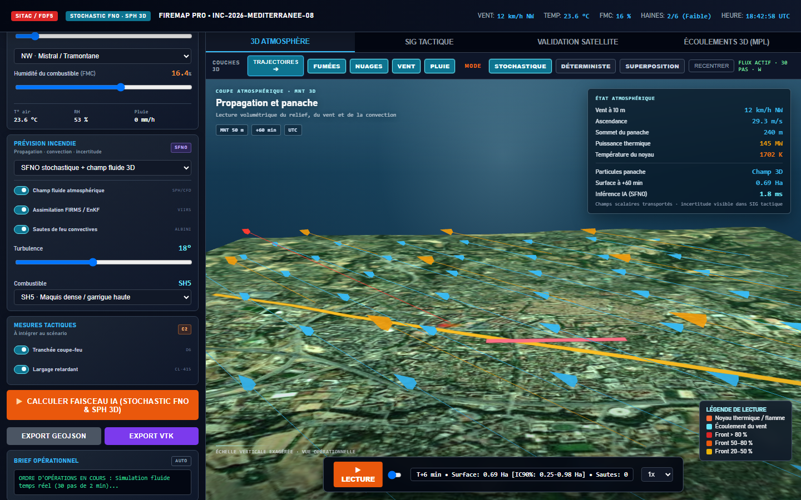
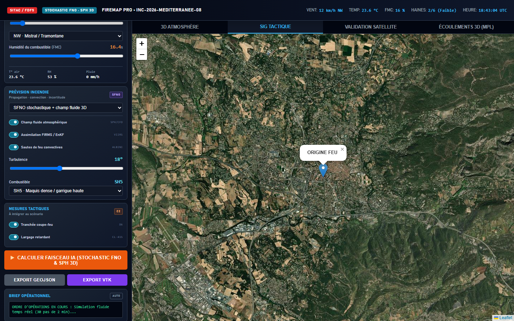
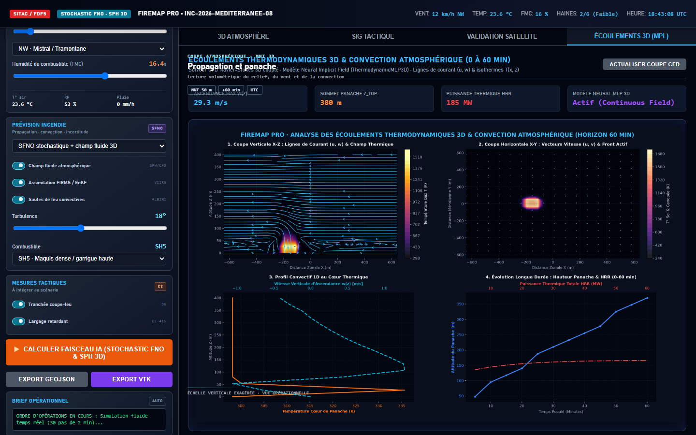
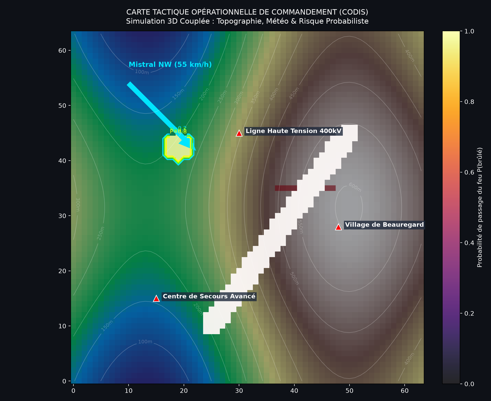

# PyroCast

AI-powered wildfire spread prediction and operational simulation.

PyroCast combines wildfire physics, weather forcing, terrain-aware meshes,
Monte Carlo inference, 2D/3D visualization, and operational exports for
field-mission analysis.

## Visual overview

<p align="center">
  
  
</p>

<p align="center">
  
  
</p>

## Main entry points

```bash
python app.py
python firemap_cli.py --help
python run_field_mission.py
python run_3d_cfd_simulation.py
python infer.py
```

Install the Python dependencies with:

```bash
python -m pip install -r requirements.txt
```

Optional graph experiments use `requirements-optional-graph.txt`.
